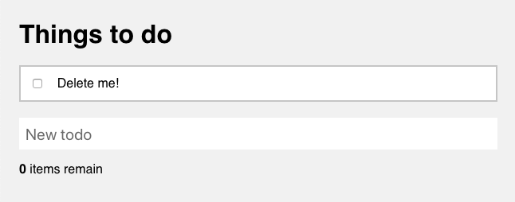
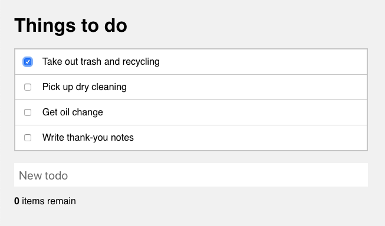
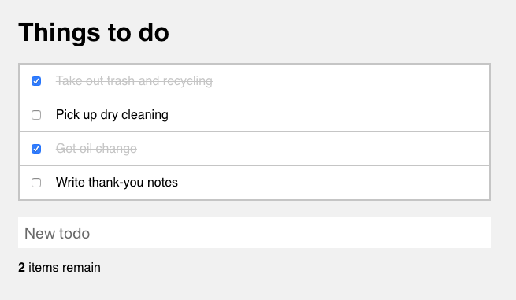
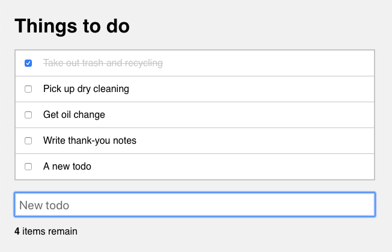
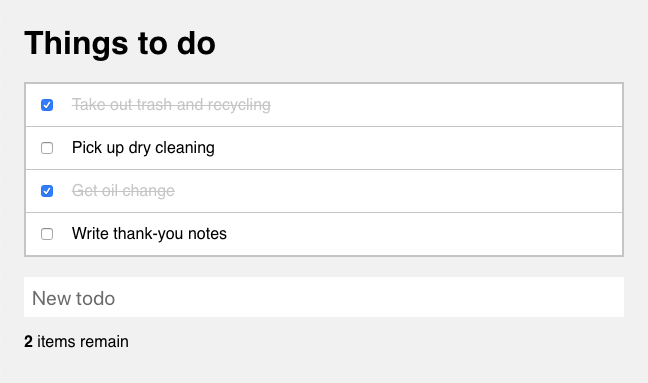
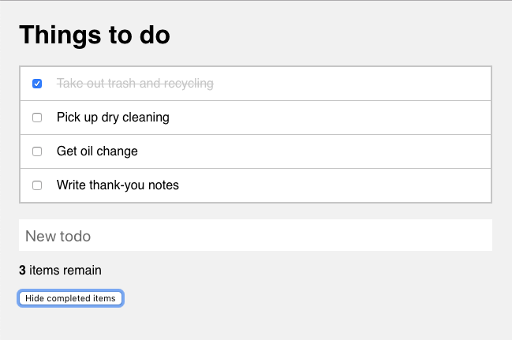
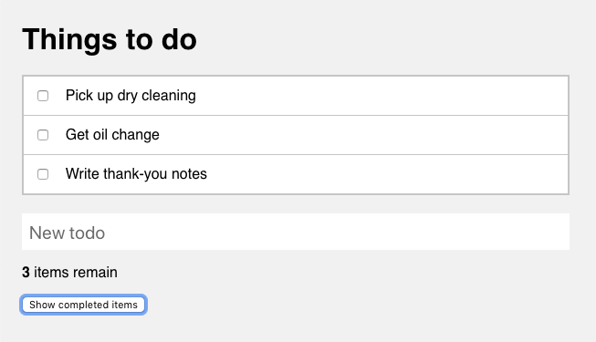

# JavaScript:  To-do List

Your task is to iteratively create a to-do list application using only JavaScript and HTML. A basic HTML layout and CSS styles have been provided in the repository.

## Tasks

### Fork this repository

Use the GitLab "fork" feature to create a copy of this repository in your own namespace. Clone the repository to your machine.

To practice with Git as you work on the project, create a branch for each new task (listed below) and merge it when you have completed the task.

### Display the list of to-do items

A sample array of to-do items is provided in the JavaScript source file. Using the skills you've developed, and thinking about good development practices, your first task is to display the list of to-do items.

### Add ability to mark to-do items complete

Now that you've displayed the to-do items on the screen, add the ability to mark a to-do as complete by clicking its checkbox. Look at the included CSS to see what you'll need to do to style the completed to-dos.

Don't forget to update the status of the completed to-do items in the source array!

### Remaining to-do count

Now that you are able to mark to-do items complete, add code to keep the `0 items remain` counter up-to-date as items are completed and un-completed.

### Create new to-do items

A static list of to-do items isn't much use. Add the ability to create new to-do items by typing them in the text input below the to-do list and hitting the `RETURN` key.

Don't forget to clear the input once the new to-do has been added.

### Modify completion behavior

The customer would like a slight usability improvement: rather than having to click the small checkbox to indicate completion of a to-do item, they'd like to be able to click anywhere in the row for that item. Implement this change for the customers.

### Toggle visibility of completed to-do items

As a final touch, add a button to the application that controls whether or not completed to-do items should be shown.

In the default state, completed to-do items should be visible, and the button text should say "Hide completed items". When clicked, the completed items should be hidden, and the button text should change to "Show completed items".

