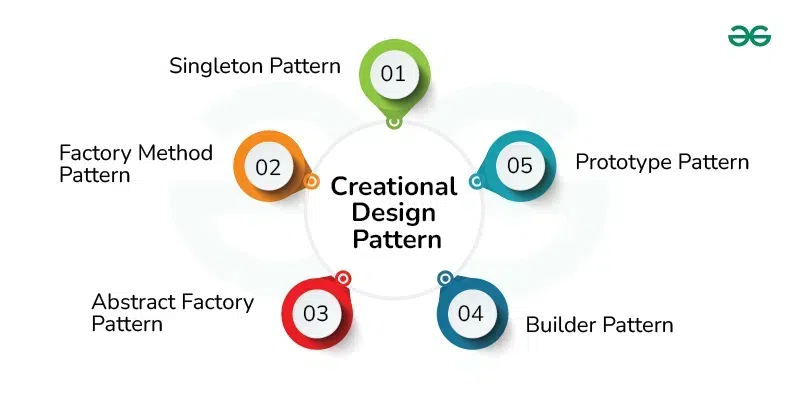
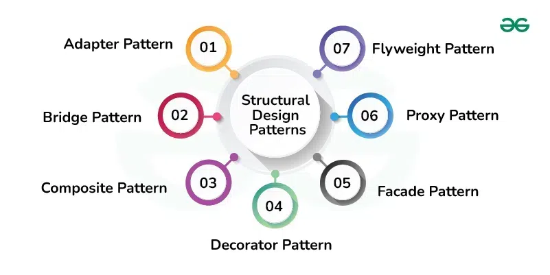
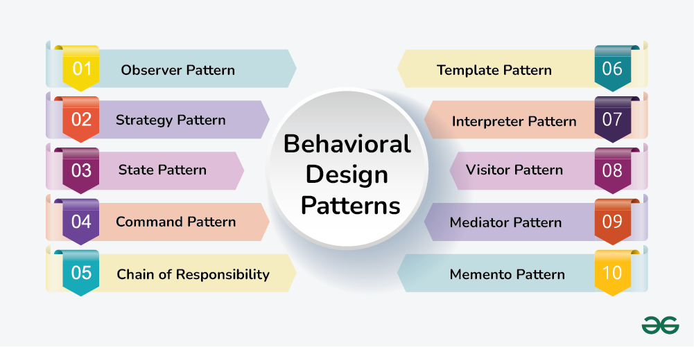

# Design Patterns
- https://medium.com/@saygiligozde/design-patterns-in-java-5251032ca244
- https://www.geeksforgeeks.org/java-design-patterns/

## 1. Creational Design Patterns
- Patterns that focus on creating objects
- They aim to enhance flexibility and efficiency in object creation, 
streamline the instantiation process and create more maintainable and adaptable code.

### Singleton
- Ensures that a class has only one instance, while providing a global access point to that instance

### Factory
- Provides an interface to create objects without the need to specify their concrete classes during the creation process.
- This pattern is helpful when it's necessary to separate the construction of an object from its implementation
- This pattern is used to conserve system resource by reusing existing objects instead of reconstructing them repeatedly

```java
public interface PaymentProcessor {

    void processPayment();
}

@Service
public class CreditCardPaymentProcessor implements PaymentProcessor {

    @Override
    public void processPayment() {
        // Credit card payment transactions
    }
}

@Service
public class PaypalPaymentProcessor implements PaymentProcessor {

    @Override
    public void processPayment() {
        // Paypal card payment transactions
    }
}

@Component
public class PaymentProcessorFactory {

    private final CreditCardPaymentProcessor creditCardPaymentProcessor;
    private final PaypalPaymentProcessor paypalPaymentProcessor;


    public PaymentProcessorFactory(CreditCardPaymentProcessor creditCardPaymentProcessor,
                                   PaypalPaymentProcessor paypalPaymentProcessor) {
        this.creditCardPaymentProcessor = creditCardPaymentProcessor;
        this.paypalPaymentProcessor = paypalPaymentProcessor;
    }

    public PaymentProcessor createPaymentProcessor(String paymentMethod) {
        if (paymentMethod.equalsIgnoreCase("creditcard")) {
            return creditCardPaymentProcessor;
        } else if (paymentMethod.equalsIgnoreCase("paypal")) {
            return paypalPaymentProcessor;
        }
        throw new IllegalArgumentException("Invalid payment method: " + paymentMethod);
    }
}
```
### Abstract Factory
- Produces families of related objects without specifying their concrete classes
- Similar to Factory Method and is considered as another layer of abstraction over Factory pattern
- Work around a super-factory which creates other factories
- Helpful when code needs to deal with different groups of related items, but needs to avoid depending on the specific types of those items

```java
//Factory Classes
public interface ProductFactory {
    Product createProduct();
}

public class ProductAFactory implements ProductFactory{
    @Override
    public Product createProduct() {
        return new ProductA();
    }
}

public class ProductBFactory implements ProductFactory{
    @Override
    public Product createProduct() {
        return new ProductB();
    }
}

//Product Classes
public interface Product {

    String getName();
}

public class ProductA implements Product {

    @Override
    public String getName() {
        return "Product A";
    }
}

public class ProductB implements Product {

    @Override
    public String getName() {
        return "Product B";
    }
}

// Create Product A using ProductAFactory
ProductFactory productAFactory = new ProductAFactory();
Product productA = productAFactory.createProduct();
System.out.println("Product A: " + productA.getName());

// Create Product B using ProductBFactory
ProductFactory productBFactory = new ProductBFactory();
Product productB = productBFactory.createProduct();
System.out.println("Product B: " + productB.getName());
```

### Builder
- Constructs complex objects step by step
- Produces different types and representations of an object using the same construction code

```java
@RestController
@RequestMapping("/api/beers")
public class BeerController {

    @GetMapping("/basic")
    public String createStandardBeer() {
        Beer beer = Beer.builder()
                .name("Standard Beer")
                .drinkSize(500)
                .alcoholPercentage(5.0)
                .price(5.99)
                .build();

        return "Created beer: " + beer.getName() + 
                ", Drink Size: " + beer.getDrinkSize() +
                ", Alcohol Percentage: " + beer.getAlcoholPercentage() +
                ", Price: " + beer.getPrice();
    }

    @GetMapping("/premium")
    public String createPremiumBeer() {
        Beer beer = Beer.builder()
                .name("Sample Beer")
                .drinkSize(330)
                .alcoholPercentage(5.0)
                .price(10.99)
                .brewery("Crafty Brews")
                .countryOfOrigin("United States")
                .description("A refreshing lager with a smooth taste.")
                .packaging("Bottle")
                .servingTemperature("4-6°C")
                .foodPairing("Pairs well with grilled chicken and salads.")
                .build();

        return "Created beer: " + beer.getName() + 
                ", Drink Size: " + beer.getDrinkSize() +
                ", Alcohol Percentage: " + beer.getAlcoholPercentage() +
                ", Price: " + beer.getPrice() +
                ", Brewery: " + beer.getBrewery() +
                ", Country of Origin: " + beer.getCountryOfOrigin() +
                ", Description: " + beer.getDescription() +
                ", Packaging: " + beer.getPackaging() +
                ", Serving Temperature: " + beer.getServingTemperature() +
                ", Food Pairing: " + beer.getFoodPairing();
    }

}

```

### Prototype
- Copies existing objects without making code dependent on their classes
- Useful when new object to be created exhibits only minor differences from an existing one

```java
@RestController
@RequestMapping("/api/trees")
public class TreeController {

    @GetMapping("/plastic")
    public String createPlasticTree() {
        Tree plasticTree = new PlasticTree();
        return "Created: " + plasticTree.getType();
    }

    @GetMapping("/pine")
    public String createPineTree() {
        Tree pineTree = new PineTree();
        return "Created: " + pineTree.getType();
    }
}
```

## 2. Structural Design Patterns



## 3. Behavioral Design Patterns

