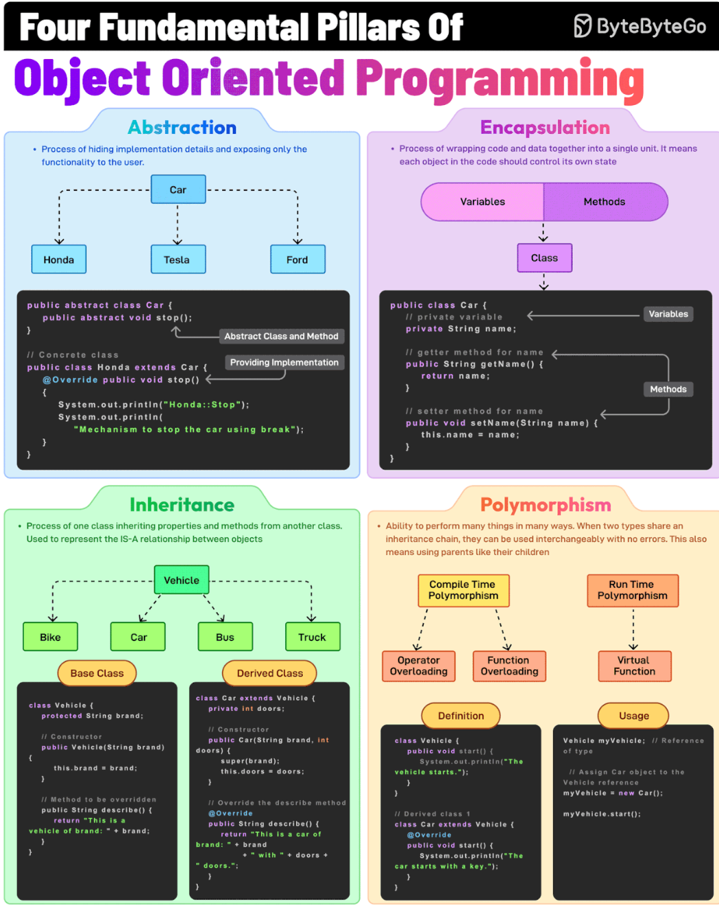

# Object-oriented programming (OOP)

## The Four Pillars of OOP

### Inheritance
- The process of creating a new class (child) that inherits attributes and methods from an existing class (parent), thereby promoting code reuse. 
- For example, a Car class inherits from a Vehicle class.

### Encapsulation
- It involves wrapping data (fields) and methods in a single unit (class) and restricting direct access using access modifiers. For example, private fields with public getters and setters.

### Abstraction
- This is the process of hiding implementation details and showing only the essential features of an object. 
- For example, a Vehicle class with an abstract stop method.

### Polymorphism
- It allows methods to perform differently based on the object they are invoked on. When two types share an inheritance chain, they can be used interchangeably with no errors.

## SOLID Principles
-These five design principles are a reminder to create maintainable, understandable and flexible software.

### S - Single Responsibility Principle (SRP)
- A class, module or function should have only one responsibility
- Benefits:
  - Testing: Fewer test cases
  - Lower coupling: Less functionality in a single class will have fewer dependencies
  - Organization: Smaller classes are easier to search

### O - Open/Closed Principle (OCP)
- A class should be open for extension, but closed for modification
- Example: Instead of adding a new field to a class, create a new class with that field that extends the previous

### L - Liskov Substitution Principle (LSP)

### I - Interface Segregation Principle (ISP)

### D - Dependency Inversion Principle

## Override vs Overload

## Interface vs Abstract Classes